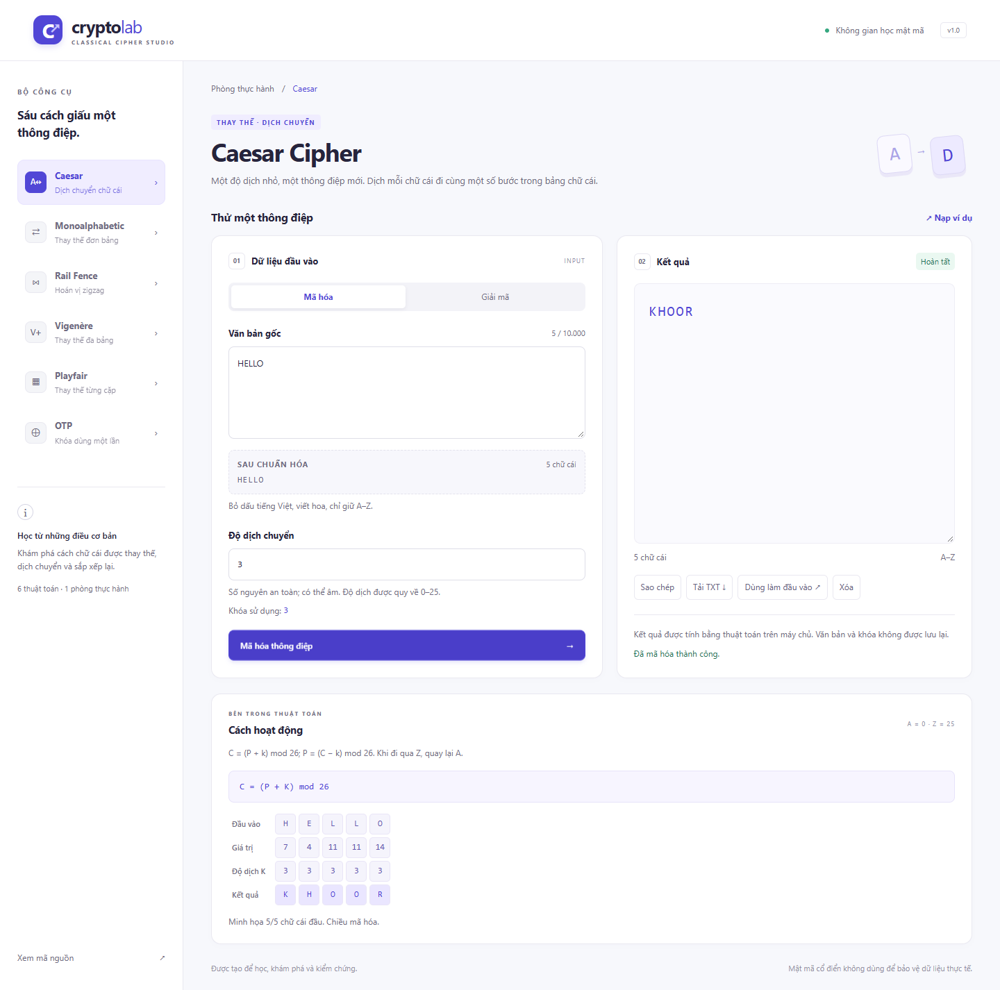

# Crypto Lab — Mật mã cổ điển

Miniproject thực hành **mã hóa và giải mã 6 thuật toán**: Caesar, Monoalphabetic, Rail Fence, Vigenère, Playfair và One-Time Pad trên alphabet A–Z. Giao diện tiếng Việt dùng HTML/CSS/JavaScript thuần; Express và Node.js xử lý thuật toán qua API trên cùng origin. Không cần Python hoặc cơ sở dữ liệu.

> Công cụ học tập. Mật mã cổ điển không phù hợp để bảo vệ dữ liệu thực tế. OTP trong ứng dụng là mô phỏng giáo dục với khóa sinh bằng bộ sinh ngẫu nhiên mật mã của máy tính; không cam kết tính ngẫu nhiên tuyệt đối.



Xem thêm giao diện [mobile](docs/mobile.png), [tablet](docs/tablet.png) và [biên bản kiểm thử](docs/verification.md). Các hình và dữ liệu ví dụ trong repository chỉ dùng minh họa, không chứa thông điệp hay khóa riêng của người dùng.

## Cài đặt và chạy

Yêu cầu **Node.js 24 LTS** và npm đi kèm. Project được kiểm tra với Node.js 24.18.0. Tham khảo [lịch phát hành Node.js](https://nodejs.org/en/about/previous-releases).

```sh
git clone https://github.com/TrongNghia30/Crypto_Miniproject.git
cd Crypto_Miniproject
npm ci
npm start
```

Mở **http://127.0.0.1:3000**. Không mở trực tiếp `public/index.html` bằng `file://`, vì giao diện cần API.

```sh
npm run dev  # Tự khởi động lại backend khi thay đổi mã nguồn
npm test     # Unit test và integration test API
```

Tùy chọn: sao chép `.env.example` thành `.env` để đặt `PORT` và `HOST`. Mặc định server chỉ lắng nghe `127.0.0.1`; muốn truy cập trong mạng nội bộ, đặt `HOST=0.0.0.0`. `.env` không được commit. Không có yêu cầu API key.

Kiểm thử giao diện bằng Chromium thật ở 375, 768 và 1440 px:

```sh
npx playwright install chromium --no-shell
npm run test:e2e
```

Playwright tự mở server kiểm thử tại cổng 3100; hãy bảo đảm cổng này đang trống. Screenshot được tạo trong `test-results/` và trace chỉ giữ khi có lỗi; các artifact này không được commit. Dữ liệu kiểm thử là ví dụ công khai, không phải dữ liệu người dùng.

## Cấu trúc

```text
public/
  index.html             Giao diện, form semantic và aria-live
  styles.css, tokens.css Thiết kế responsive
  app.js                 Trạng thái, tương tác và gọi API
  catalog.js             Mô tả, hướng dẫn và ví dụ
  visualization.js       Bảng chữ, công thức, zigzag và ma trận
  shared/
    normalize.js         Chuẩn hóa, ma trận, chuẩn bị cặp, vị trí rail
    validation.js        Kiểm tra dữ liệu dùng chung hai phía
server/
  app.js                 Express, REST API, static files và xử lý lỗi
  index.js               Khởi động server và đọc cấu hình
  ciphers.js             Logic biến đổi của sáu thuật toán
  keys.js                Tạo khóa bằng node:crypto
test/                    Unit test và integration test
e2e/                     Kiểm thử trình duyệt thực tế
```

Frontend hiển thị bản xem trước bằng **cùng module chuẩn hóa** mà backend sử dụng. Backend vẫn tự validation mỗi request, không tin dữ liệu đã được kiểm tra ở trình duyệt. Thuật toán mã hóa/giải mã được thực thi trên backend; frontend chỉ minh họa từ dữ liệu trả về.

## Luồng sử dụng

1. Chọn thuật toán trong sidebar hoặc dropdown trên điện thoại.
2. Chọn Mã hóa/Giải mã và nhập văn bản, khóa. Có thể chọn **Nạp ví dụ**.
3. Xem bản chuẩn hóa, độ dài và khóa sử dụng. Monoalphabetic/OTP có **Tạo khóa**.
4. Thực hiện, đọc kết quả và minh họa ở phần **Cách hoạt động**.
5. Sao chép, tải TXT hoặc **Dùng làm đầu vào** để đổi chiều xử lý và giữ khóa.

Khi thay đổi văn bản, khóa, chế độ hoặc thuật toán, kết quả cũ được xóa. Nếu thay đổi dữ liệu khi request còn đang chạy, response cũ không được hiển thị. Không cho gửi đồng thời nhiều yêu cầu xử lý/tạo khóa. Yêu cầu quá 15 giây được hủy và hiển thị lỗi.

Clipboard cần quyền trình duyệt; nếu bị chặn, kết quả được chọn để người dùng sao chép thủ công. Khi tải TXT, file chỉ chứa kết quả, không chứa khóa.

## Chuẩn hóa và giới hạn

- Unicode NFD → loại dấu kết hợp → `đ/Đ` thành `D` → viết hoa → chỉ giữ `A–Z`.
- Ví dụ: `Xin chào, Đạt! 123` → `XINCHAODAT`.
- Mọi thuật toán dùng cùng quy tắc, kể cả Rail Fence. Khóa chữ cũng được chuẩn hóa; khóa số phải là số nguyên đầy đủ, không chấp nhận `3abc`, `1.5` hay `1e2`.
- Văn bản chuẩn hóa không được rỗng. Giới hạn **10.000 ký tự** cho cả văn bản/khóa gốc và văn bản/khóa sau chuẩn hóa. Playfair kiểm tra thêm giới hạn 10.000 ký tự sau chèn đệm.
- Dấu, khoảng trắng và ký tự bị loại bỏ **không thể khôi phục** khi giải mã. Unicode chuyển hoa có thể mở rộng ký tự, ví dụ `ß` → `SS`, nên độ dài chuẩn hóa cũng được kiểm tra.
- Playfair gộp `J→I`; `normalized_text`/`normalized_key` phản ánh việc gộp này. Khóa Playfair trong response giữ thứ tự và chữ trùng; việc loại trùng chỉ thực hiện khi dựng ma trận.
- JSON body tối đa **256 KB**. Hệ thống không lưu văn bản hoặc khóa vào log, localStorage hay cơ sở dữ liệu. Khi đang sử dụng, dữ liệu vẫn tồn tại trong bộ nhớ trình duyệt và server để xử lý yêu cầu.
- Minh họa giới hạn 12 chữ cái, riêng Rail Fence là 32; bảng thay thế Monoalphabetic luôn đủ 26 chữ. Rail Fence giải mã minh họa đường zigzag của bản rõ đã tái dựng.

## Quy tắc thuật toán

Quy ước `A=0 … Z=25`, modulo luôn trả về số không âm.

| Thuật toán     | Mã hóa / giải mã                                              | Khóa                                 |
| -------------- | ------------------------------------------------------------- | ------------------------------------ |
| Caesar         | `C=(P+k) mod 26`; `P=(C−k) mod 26`                            | Số nguyên an toàn, quy về 0–25       |
| Monoalphabetic | Ánh xạ A–Z sang khóa / ánh xạ nghịch đảo                      | Hoán vị đúng 26 chữ A–Z              |
| Rail Fence     | Viết zigzag và đọc từng hàng / tái dựng vị trí rồi đọc zigzag | Số rail nguyên 2–1000                |
| Vigenère       | `Cᵢ=(Pᵢ+Kᵢ) mod 26`; `Pᵢ=(Cᵢ−Kᵢ) mod 26`                      | Từ khóa không rỗng, lặp theo văn bản |
| Playfair       | Biến đổi từng cặp trong ma trận 5×5                           | Từ khóa không rỗng                   |
| OTP A–Z        | Cộng / trừ từng chữ khóa modulo 26                            | Độ dài bằng chính xác văn bản        |

**Rail Fence:** bắt đầu ở rail 0 và đi xuống. Khi rail ≥ độ dài văn bản, kết quả giữ nguyên. Logic giải mã dùng bộ đếm và con trỏ theo rail, không tạo ma trận `rails × textLength`; bộ nhớ O(n + rails).

**Playfair:** gộp J vào I; loại chữ khóa trùng theo thứ tự, rồi bổ sung `ABCDEFGHIKLMNOPQRSTUVWXYZ`. Chia cặp tuần tự: cặp trùng chèn X; nếu chữ trùng là X, chèn Q. Chữ cuối lẻ được đệm tương tự. Ví dụ `BALLOON` → `BALXLOON`, `XX` → `XQXQ`.

- Cùng hàng: dịch phải khi mã hóa, trái khi giải mã, có vòng lại.
- Cùng cột: dịch xuống khi mã hóa, lên khi giải mã, có vòng lại.
- Khác hàng/cột: đổi cột trong hình chữ nhật.
- Giải mã chỉ nhận độ dài chẵn và **không tự xóa X/Q**: ký tự này có thể thuộc bản rõ thật. Kết quả là bản rõ đã chuẩn bị, không nhất thiết là văn bản gốc.

**OTP:** không lặp/cắt khóa. Khóa được sinh từng chữ bằng `crypto.randomInt(0, 26)`. Tính chất OTP lý tưởng yêu cầu khóa ngẫu nhiên thật, bí mật, dài bằng thông điệp và chỉ dùng một lần. Ứng dụng không theo dõi hay ngăn việc tái sử dụng khóa; người dùng có trách nhiệm tuân thủ quy tắc. Monoalphabetic sinh hoán vị bằng Fisher–Yates và `crypto.randomInt`, không dùng `Math.random`.

## Ví dụ kiểm chứng

| Thuật toán     | Bản rõ                    | Khóa                       | Bản mã                     |
| -------------- | ------------------------- | -------------------------- | -------------------------- |
| Caesar         | HELLO                     | 3                          | KHOOR                      |
| Monoalphabetic | ABCXYZ                    | ZYXWVUTSRQPONMLKJIHGFEDCBA | ZYXCBA                     |
| Rail Fence     | WEAREDISCOVEREDFLEEATONCE | 3                          | WECRLTEERDSOEEFEAOCAIVDEN  |
| Vigenère       | ATTACKATDAWN              | LEMON                      | LXFOPVEFRNHR               |
| Playfair       | HIDETHEGOLDINTHETREESTUMP | PLAYFAIREXAMPLE            | BMODZBXDNABEKUDMUIXMMOUVIF |
| OTP            | HELLO                     | XMCKL                      | EQNVZ                      |

Playfair giải mã ví dụ trên thành `HIDETHEGOLDINTHETREXESTUMP`, chứa X đã chèn giữa hai chữ E.

## REST API

### `POST /api/process`

Content-Type: `application/json`. `text` và `key` bắt buộc là chuỗi, kể cả khóa số.

```json
{ "cipher_type": "caesar", "text": "Hello!", "key": "3", "mode": "encrypt" }
```

`cipher_type`: `caesar|mono|rail|vigenere|playfair|otp`; `mode`: `encrypt|decrypt`.

```json
{
  "status": "success",
  "result": "KHOOR",
  "normalized_text": "HELLO",
  "prepared_text": "HELLO",
  "normalized_key": "3"
}
```

`prepared_text` là văn bản thực sự đưa vào thuật toán, gồm ký tự đệm khi mã hóa Playfair. Khi giải mã, đây là bản mã chuẩn hóa. `normalized_key` của Caesar là độ dịch 0–25 dưới dạng chuỗi.

### `POST /api/generate_key`

```json
{ "cipher_type": "otp", "text_length": 5 }
```

Trả `{ "key": "..." }`. OTP yêu cầu `text_length` là số nguyên 1–10.000, bằng độ dài văn bản chuẩn hóa. Monoalphabetic chỉ cần `{ "cipher_type": "mono" }`; `text_length` không dùng.

### Lỗi

```json
{
  "status": "error",
  "error": {
    "code": "INVALID_INPUT",
    "message": "Khóa phải là số nguyên an toàn, không chứa ký tự khác.",
    "field": "key"
  }
}
```

HTTP **400**: validation/JSON không hợp lệ; **413**: body vượt 256 KB; **404**: endpoint API không tồn tại; **500**: lỗi nội bộ với thông báo chung. `field` có thể là `text`, `key`, `mode`, `cipher_type`, `text_length` hoặc `request`. API trả `Cache-Control: no-store`.

## Kiểm thử và bàn giao

Unit/integration test bao phủ vector hai chiều của cả 6 thuật toán, round-trip, tiếng Việt, khóa sai, giới hạn, Playfair chữ trùng/đệm/J, Rail Fence nhiều rail, sinh khóa, JSON hỏng và body quá lớn. E2E bao phủ luồng ví dụ và giải mã ngược, tải TXT, clipboard, chuẩn hóa, lỗi trường, sinh khóa, xóa kết quả cũ, response không JSON, lỗi mạng và sửa đầu vào khi request chưa hoàn tất ở ba kích thước màn hình.

Repository lưu mã nguồn. **GitHub Pages không chạy backend Node.js**, nên không thể đưa toàn bộ ứng dụng này lên Pages như một website tĩnh. Triển khai dịch vụ hosting không thuộc phạm vi miniproject này.
